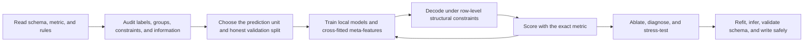

# Problems and Approaches

This guide documents the **40 challenge directories** that were present when it was written. The live repository now retains **24 scored, non-rejected challenges**: 11 challenges whose PDF entries never received a numeric score and 5 challenges with a `Rejected` entry were removed using `project-eris-july.pdf`. The empty `template/` directory is scaffolding, not a challenge.

The per-problem sections remain as a historical educational catalog, so they intentionally include the removed challenges.

This document has four goals:

1. explain what every challenge is actually asking;
2. explain the modeling reduction used in the repository;
3. extract the reusable method that emerged across the solutions; and
4. separate modeling lessons from current Project Eris execution/compliance requirements.

The central observation is that these are rarely ordinary classification problems. Most are **structured decision problems**: predict local probabilities, then choose a globally valid object under task-specific constraints and a non-decomposable metric.

---

## 1. The method we created: contract-first, evidence-guided structured learning

There is no single model shared by all folders. The shared contribution is a **problem-solving method**:

> Read the contract exactly, identify the true decision unit, learn calibrated local evidence without leakage, and use a constrained decoder to optimize the real metric.

A compact mathematical description is

\[
\hat y
= \arg\max_{y \in \mathcal Y(x)} U\bigl(y; p_\theta(\cdot\mid x)\bigr),
\]

where:

- \(p_\theta\) is learned from training data;
- \(\mathcal Y(x)\) is the set of outputs allowed by the row's explicit constraints; and
- \(U\) is expected utility under the challenge metric, not necessarily plain accuracy.

This is the recurring pattern behind beam search, Viterbi, Hungarian matching, subset dynamic programming, top-\(k\) ranking, threshold search, graph aggregation, and mask projection throughout the repository.

### 1.1 Start with the contract, not the model

For every task, write down before modeling:

- exact output columns and serialization;
- allowed labels, token grammar, coordinate convention, and empty-output convention;
- the complete metric, including worst-group, lower-tail, calibration, exact-match, or consistency terms;
- the real deployment split: new users, new patients, later time, new routes, new policies, new rasters, or random rows;
- challenge-specific restrictions and runtime limits.

This changes the statistical problem. Examples:

- **Hidden Binary Stars** uses a weighted normalized squared error over ordinal bin indices. Continuous regression on variance-standardized targets is therefore a better metric surrogate than eight unrelated classifiers.
- **Media Session Continuation Ranking** is NDCG@3 within each 12-item query. A query-grouped ranker is better aligned than a pointwise relevance regressor.
- **Evidence-Guided Flood Mask Repair** rewards both editing and preservation. Predicting a fresh flood mask ignores the strongest prior: the draft is mostly correct.
- **Vector Fragment Route Program Repair** includes a large exact-program term. Independent edge accuracy is insufficient; the decoder must return one valid Hamiltonian path.

### 1.2 Audit information before adding capacity

The best solutions first ask what is identifiable from the released evidence.

Useful diagnostics include:

- conditional entropy or simple oracle baselines;
- candidate-pool oracle recall;
- label ambiguity among rows with identical released features;
- performance by group, rarity, output length, or missingness;
- recall@\(K\) versus top-\(K\) ranking quality;
- train/validation and train/test support overlap;
- whether the metric is dominated by emptiness, exactness, tails, or rare classes.

Examples:

- **Deadzone** found that the previous hidden state almost determines the next state, while the current symbol alone does not. That justifies a recurrent encoder plus CRF.
- **Collapsed Branch Side Set Recovery** found many evidence-equivalent bipartitions and an oracle-size ceiling near 0.52. More model capacity cannot recover information absent from the sparse pair evidence.
- **Coastal Sensor Signature Recommendation** found recall@50 near 0.98. Retrieval was already solved; the remaining problem was ordering near-miss candidates into the top five.
- **Anonymous Visual Operator Relay** found that empty versus non-empty edit masks were much easier, and more valuable, than precise localization. A separate emptiness gate was therefore rational.

### 1.3 Reduce the output to the smallest learnable decisions

Several apparently generative tasks become tractable after algebraic or structural reduction:

- molecular graph patches become product-bond-order prediction;
- phylogenetic reconstruction becomes ranking valid anchor-side subsets;
- citation repair becomes operation-family classification plus row-local target ranking;
- graph repair becomes candidate-edge multilabel classification;
- route generation becomes next-fragment scoring plus constrained search;
- ECG transcription becomes samplewise event heatmaps plus sequence decoding;
- mask repair becomes three pixel states: keep, add, remove.

The reduction should preserve the full answer space. It must not silently rule out valid targets merely because they are inconvenient for the model.

### 1.4 Match validation to the unit of generalization

Random row splits are often wrong because rows share a latent source. The repository's strongest validation designs group by the thing that will be new at deployment:

| Deployment risk | Correct grouping example |
|---|---|
| New patient or recording | patient/record groups in both ECG tasks |
| New source raster | `raster_path` for flood-mask repair |
| New user | `user_id` for media ranking |
| New policy | `policy_id` for privacy evidence routing |
| New query/document | `query_doc_id` for biomedical ranking |
| New route or locale pair | directed route in cross-locale propagation |
| Near-duplicate sequence | overlap-connected components in vocal routing |
| Future time | rolling-origin and skip-gap folds in adverse-event recommendation |
| New acoustic condition | acoustic-family groups in the bat challenge |

For a stacked pipeline, ordinary folds are not enough. A training row's meta-feature must come from a model that did not train on that row:

\[
z_i = f_{-\mathrm{fold}(i)}(x_i).
\]

This cross-fitting pattern appears in the ECG stacks, causal pathway repair, coastal hidden-summary regressors, candidate rerankers, and many calibration layers.

### 1.5 Let models score; let algorithms enforce known constraints

A useful separation is:

- **learned component:** uncertain semantic, visual, acoustic, or relational choice;
- **decoder:** indisputable schema and combinatorial validity.

Good hard constraints include:

- each route fragment is used once;
- stream lengths and multisets match the row's supplied values;
- additions occur only where the draft is zero and audit is one;
- graph edges reference submitted nodes;
- event times are sorted and bounded;
- a ranking contains unique candidates;
- a cipher map is one-to-one when the task explicitly says it is.

The decoder should not contain a discovered answer mapping. Under the current guidebook, if removing all trained models still leaves a useful prediction system, too much of the answer has been encoded as rules, retrieval, or templates.

### 1.6 Tune decisions on out-of-fold probabilities against the real metric

A probability model and an optimal action are different objects. The right threshold or sequence can depend on class weights, empty-set conventions, exact-match bonuses, or tail terms.

Examples include:

- thresholding beat types against the complete ECG score;
- choosing mask count and temperature under repair-window utility;
- selecting route candidates by a learned metric regressor;
- calibrating confidence against actual out-of-fold correctness;
- using per-family graph-edge thresholds because class prevalence and value differ;
- decoding a symmetry-group multiset rather than independently taking per-probe argmax.

Search these choices inside the script on train-only held-out or OOF predictions. Do not paste values selected from the public leaderboard.

### 1.7 Diagnose before adding another model

The repository repeatedly shows that “more models” is not a strategy.

- If recall@50 is high but MAP@5 is low, improve the ranker, not retrieval.
- If several embeddings come from the same co-occurrence matrix, they may be mathematically different but informationally redundant.
- If a second model adds a genuinely different inductive bias, expose its prediction as a feature so the final learner can conditionally use it. This worked in **Coastal Sensor Signature Recommendation**; many fixed score blends did not.
- If a new validation delta is smaller than split variance, treat it as unresolved. **Chess** documents how nominally consistent sub-1% gains failed to transfer.
- If identical released features have conflicting labels, estimate a ceiling rather than endlessly increasing capacity.

### 1.8 Treat output reliability as part of the model

A high-quality model that writes malformed output scores worse than a weak valid baseline. The current method therefore includes:

- write a complete schema-valid placeholder before heavy work;
- stop launching training before the hard runtime limit;
- isolate per-row failures and emit a valid, explicitly weak fallback;
- validate columns, IDs, counts, JSON/RLE grammar, ranges, disjointness, and row-level invariants;
- fit every statistic on train only; use test for transform/predict only;
- fix seeds and keep the submitted solution self-contained.

See [`PROMPT.md`](PROMPT.md) for the current operational contract and the root solver guidebook for platform rules.

---

## 2. Complete problem map

“Review” below is a repository-status note, not a claim about leaderboard acceptance.

| # | Problem | Domain | Core reduction / model | Repository status |
|---:|---|---|---|---|
| 1 | Adverse Event Reaction Code Recommendation | temporal multilabel ranking | report-code LambdaRank with cross-fitted base learners | implemented; legacy/current-rule re-audit |
| 2 | Anonymous Bat Conversation Graph Recovery From Reference Calls | bioacoustics + graph prediction | row-local matching, joint call ranking, learned graph decoder | implemented, current-style audit |
| 3 | Anonymous Visual Operator Relay | few-shot vision | emptiness gates + conditioned U-Net + decoy ranker | implemented, current-style audit |
| 4 | Anonymized Vocal Fragment Routing | symbolic music | step models + pointer network + feasible beam + reranker | implemented |
| 5 | Biomedical Concept Evidence Ranking | information retrieval | semantic feature bank + CatBoost YetiRank | implemented, train-only document fit |
| 6 | Biomedical Evidence Graph Omission Repair | biomedical graph completion | enumerate candidate edges, classify labels, threshold | implemented as legacy multi-file package |
| 7 | Bone Niche Cellular Region Detection | object detection | fine-tuned Faster R-CNN MobileNet-FPN | implemented; legacy runtime contract |
| 8 | Carbon Assignment Batch Drift Forensics | chemistry + batch classification | clean-shift regressors + joint forensic classifier | implemented; current-rule re-audit |
| 9 | Causal Pathway Event Repair | structured graph repair | cross-fitted candidate/role/regulation/abstention heads | implemented |
| 10 | Chess Move-Prefix Outcome Distribution Prediction | probabilistic forecasting | empirical-Bayes prefix trie + linear/tree ensemble | implemented; legacy runtime contract |
| 11 | Coastal Sensor Signature Recommendation | retrieval/ranking | hidden-summary regressors + neighbor votes + LambdaRank | implemented; legacy runtime contract |
| 12 | Code Behavior Fingerprint Recovery | code understanding | text k-NN + static/runtime signals + mask construction | implemented; legacy/external-cache path |
| 13 | Collapsed Branch Side Set Recovery | phylogenetics | enumerate valid sides, edge model, candidate model | implemented |
| 14 | Cross-Lead ECG Wave Landmark Recovery | biosignal event detection | signal proposals + learned presence/timing transfer | implemented |
| 15 | Cross-Locale Repair-Window Propagation | multilingual structured prediction | transformer over aligned windows + utility decoder | implemented |
| 16 | Crossed-Turn Draft Reframing | opaque-text classification | cross-field association + logistic risk model | implemented; transductive legacy path |
| 17 | Deadzone: Hidden-State Transduction from Paired Symbol Sequences | sequence labeling | bidirectional RNN + CRF + metric-tuned Viterbi | implemented |
| 18 | Dictionary Definition Fragment Ordering | sequence ordering | sparse sequence models + exact subset DP | implemented; transductive legacy path |
| 19 | DNA Barcode Family and Artifact Detection | sequence biology | codon/frame features + residual 1D CNN | implemented; legacy runtime contract |
| 20 | Docstring Gap Restoration | code-language generation | partial CodeT5 fine-tuning | implemented, current-style audit |
| 21 | Evidence-Guided Flood Mask Repair | geospatial vision | no implementation yet; proposed three-state repair model | **incomplete: `solution.py` is empty** |
| 22 | GUI Widget Grounding and Interaction Prediction | vision-language grounding | OCR/pixel features + blocker classifier + box correction | implemented; legacy/current-rule re-audit |
| 23 | Habitat Instance Contact Recovery | detection + topology | Faster R-CNN + learned pair-contact model | implemented, current-style audit |
| 24 | Hidden Binary Stars | scientific time series | weighted multi-output residual 1D CNN regression | implemented, current-style audit |
| 25 | Historical OCR Verification and Repair Challenge | OCR/text repair | learned edit channel + language/visual scoring + classifier | implemented; current-rule re-audit |
| 26 | Interleaved Loanword Stream Deconvolution | constrained seq2seq | conditional GRU + forward/reverse feasible beam | implemented, current-style audit |
| 27 | Intraoperative ECG Beat-and-Rhythm Transcription | biosignal multitask learning | dilated TCN + event decoder + CatBoost rhythm head | implemented, current-style audit |
| 28 | Lean Proof Patch Recovery | program repair | location model + candidate generation + joint ranker | implemented; current-rule re-audit |
| 29 | Media Session Continuation Ranking | recommender systems | sequence-shift features + graph/temporal features + LambdaRank | implemented; transductive legacy path |
| 30 | Microscoppy Bacilli Localization and Counting | medical object detection | proposed YOLO + count regressor + domain augmentation | design/code present; full training unverified |
| 31 | Mobile App Privacy Policy Evidence Routing | retrieval/ranking | cross-encoder + hand features + LambdaRank | implemented; transductive/cache legacy path |
| 32 | Multilingual Conditional Tool Contract Induction | multilingual generation | structured neural contract model + LoRA generator + scorer | implemented, current-style audit |
| 33 | Ornament Sequence Recovery from Lossy Performance Views | symbolic/acoustic sequence modeling | target-excluded trees and recurrent ensembles | implemented |
| 34 | Phase-Conditioned Procedure Span Infilling | masked span generation | fine-tuned BERT + cross-fitted full-span classifier | implemented, current-style audit |
| 35 | Polyphonic Vocal Passage Event Recovery | symbolic music | duration DP + CatBoost rankers + Viterbi | implemented |
| 36 | Regulatory Citation Repair Program Synthesis | program synthesis/ranking | operation classifier + conditional-logit target models | implemented |
| 37 | Swadesh Phoneme Cipher Decoding | computational linguistics | EM cognate alignment + neural low-confidence ranker | implemented |
| 38 | Transition-State Molecular Graph Delta Recovery | chemistry | product-order classifiers + symmetry multiset decoder | implemented; current-rule re-audit |
| 39 | Vector Fragment Route Program Repair | geometric structured prediction | staged rankers + exact/beam route decoding | implemented |
| 40 | Vector Stroke Gap Reconstruction | geometric sequence recovery | symmetry-normalized templates + learned ranking + connected DP | implemented; legacy runtime contract |

---

## 3. Vision and spatial problems

### 3.1 Evidence-Guided Flood Mask Repair

**Problem.** Each case provides an 8-channel raster, an 8-channel validity mask, a mostly-correct draft flood mask, and an audit mask. The output is not a new segmentation; it is two sparse RLE masks: pixels to add and pixels to remove. Edits must be inside the audit region, additions must start on draft-zero pixels, removals on draft-one pixels, and the two masks must be disjoint.

The per-case score is 40% edit F1, 25% repaired-mask IoU inside the audit region, 15% boundary F1, 10% preservation, and 10% connected-component agreement. The final score is 85% mean case score plus 15% lower-quartile score. This strongly rewards restraint and consistency.

**Repository status.** `solution.py` is empty, so there is no created implementation to explain or score.

**Recommended approach, not yet implemented.** Group validation by `raster_path`; build inputs from raster values, validity indicators, draft, audit, distance-to-draft-boundary, and local terrain gradients; train a compact U-Net or FPN with three states `{keep, add, remove}` plus a case-level no-change head. Use class-balanced focal/BCE and Dice terms only on legal audit pixels, then project logits onto the hard validity constraints. Search add/remove/no-change thresholds independently on grouped OOF predictions using the exact composite metric. A component-aware postprocessor may remove tiny low-confidence islands, but only if its parameters are selected on train-only validation. The first required comparison is against the copy-draft baseline.

**Lesson.** The draft is a strong prior. Model the residual intervention, not the entire scene.

### 3.2 Anonymous Visual Operator Relay

**Problem.** A contact sheet contains four source/result demonstrations, one query source, and one decoy demonstration. Three supports share a hidden image operator. The output contains four support probabilities, query increase/decrease masks, and whole-response confidence. Masks dominate the metric, while exact support and relay calibration also matter.

**Approach.** The solution factorizes the task into three learned parts. Logistic-regression gates predict whether each direction should be empty. A from-scratch, operator-conditioned U-Net encodes source/result examples, forms class prototypes, downweights an inconsistent demonstration, and predicts a three-class query map `{none, increase, decrease}`. A LightGBM odd-one-out model scores support consistency. A final logistic calibrator predicts exact relay success from held-out outcomes.

The useful architectural idea is **prototype-conditioned discriminative segmentation**: support examples summarize the operator, while the query decoder remains nonlinear and spatial. A three-class softmax guarantees disjoint masks.

**Evidence and limitation.** Emptiness is nearly solved and is a large metric lever; decoy top-1 accuracy is roughly 0.79. Non-empty localization remains around 0.5–0.6 F1 because three examples can underdetermine the operator.

**Lesson.** Separate “should anything change?” from “where should it change?” when class imbalance and empty-set scoring make them statistically different questions.

### 3.3 Habitat Instance Contact Recovery

**Problem.** Detect every habitat instance and recover undirected contacts among detected instances. Detection is balanced across empty, single-instance, and multi-instance strata; topology balances no-contact and contact images; the final score is their geometric mean.

**Approach.** A COCO-initialized Faster R-CNN ResNet-50-FPN v2 is genuinely fine-tuned with small custom anchors and geometry-preserving augmentation. For every predicted pair, a train-fitted quantile transform and logistic classifier score contact from 17 symmetric box-geometry features. Detection and contact thresholds are jointly searched on a stratified train holdout using Hungarian box matching and the local composite.

**Why it works.** Detection and topology are different tasks. A detector should learn appearance and location; a small pair model can learn contact once nodes exist. The geometric mean means neither component can be ignored.

**Limitation.** No session identifier is supplied, so validation can stratify metric-critical groups but cannot prove capture-session independence.

**Lesson.** For graph-from-image tasks, learn nodes first, learn edges second, and validate the composed graph—not just the two heads in isolation.

### 3.4 Vector Stroke Gap Reconstruction

**Problem.** Recover an ordered sequence of missing grid cells between visible stroke prefix and suffix. The metric combines set overlap, ordered LCS, exact output length, and endpoint agreement.

**Approach.** Complete training strokes become a template bank. Candidate windows are canonicalized under all eight square symmetries and retrieved by missing length and endpoint displacement. A LightGBM LambdaRank model scores whole paths; two cell classifiers estimate exact-position and set-membership probabilities; dynamic programming chooses a connected path whose transitions are valid 8-neighbors.

Leave-one-row-out template construction prevents a row's own completed stroke from being its retrieval answer during validation. The method progresses from Hermite interpolation to template consensus to learned path/cell scoring, reaching about 0.669 five-fold score.

**Lesson.** Retrieval is most useful when it proposes geometrically valid support. The trained ranker and decoder should decide among candidates. Also, exploit exact symmetries before asking a model to relearn them from limited data.

**Current-rule note.** The current implementation uses a legacy CLI and relies heavily on retrieved paths; under today's strip-the-ML rule it deserves a fresh review even though the ranking stages are learned.

### 3.5 Bone Niche Cellular Region Detection

**Problem.** Detect osteoblast-associated and osteoclast-associated regions in 512×512 grayscale microscopy patches. The official metric is class-averaged AP at IoU 0.50.

**Approach.** Fine-tune Faster R-CNN with a MobileNetV3-Large FPN backbone initialized from general COCO weights. Keep native 512 resolution, replace the box head with two foreground classes, and apply the eight orientation symmetries, crop/resize, intensity jitter, and noise with boxes transformed in lockstep. Select the best checkpoint by a local implementation of the exact AP50 metric.

**Why this model.** FPN covers the large class-dependent box-size range; MobileNet permits more epochs under CPU constraints; pretrained low-level visual features help with only about 1,140 images.

**Lesson.** Choose the backbone with the end-to-end compute budget in mind. A smaller model trained adequately can beat a larger model stopped early.

**Current-rule note.** The folder predates the positional-argument, early-placeholder, and one-output-path contract and should be modernized before a current submission.

### 3.6 Microscoppy Bacilli Localization and Counting

**Problem.** Detect and count TB bacilli. The score mixes AP50, AP25, count accuracy, burden-bin macro-F1, two domain-shift tracks, an extreme-burden track, and negative-image specificity.

**Designed approach.** The README proposes YOLO11, an independent EfficientNet count regressor, TTA/WBF, a conservative two-signal empty-image gate, and domain-conditioned resolution. It emphasizes AP25 recall and shift robustness rather than AP50 alone.

**Important status.** The README explicitly says full detector/regressor training and inference were not executed locally. Only metric anchors, formatting, data preparation, synthetic color transfer, and simulated postprocessing were checked. Therefore this is a design with partial integration evidence, not an observed trained solution.

**Current-rule conflicts.** The design measures a test-only blue domain, creates synthetic color-transfer and pasted-rod training examples, auto-installs dependencies, and uses fixed-path conventions. Those choices conflict with the current train-only/no-synthetic/allowed-environment method in `PROMPT.md`.

**Lesson.** Metric analysis was strong, but a plausible architecture is not evidence until the actual model trains, predicts, and is scored end to end under the allowed data flow.

### 3.7 GUI Widget Grounding and Interaction Prediction

**Problem.** From a screenshot and instruction, predict a target box, action, role, blocker, repair sequence, and final status. The metric combines box quality, sequence edit similarity, and inverse-frequency-weighted F1 for four categorical outputs.

**Approach.** OCR locates instruction text; learned per-role offsets convert text boxes into widget boxes; pixel and OCR-match features feed a random-forest blocker classifier; a char-TF-IDF logistic model handles ambiguous action text. Local OOF score was reported near 0.588 versus a 0.117 sample baseline.

**What is instructive.** Raw OCR boxes are labels, not controls. Grounding requires learning the geometric relation from label text to widget. Joint blocker classification works better than an isolated wrong-page gate because low OCR confidence has multiple causes.

**Current-rule conflicts.** The implementation uses a Homebrew Tesseract executable and an OCR cache; several outputs are emitted by hand-asserted mappings after discovering deterministic train regularities. Those are explicitly disallowed by the current runtime and hardcoding rules. A modern version should fine-tune an allowed visual/text backbone and train all output heads, using OCR-like information only as model input support.

---

## 4. Scientific signals, audio, and ECG

### 4.1 Hidden Binary Stars

**Problem.** A 7,514-sample near-IR spectrum blends two unresolved stars. Predict eight ordinal bins: three primary atmosphere values, three secondary atmosphere values, secondary light fraction, and radial-velocity difference. The metric is a weighted normalized squared error, with half the weight on the difficult secondary atmosphere.

**Approach.** A residual 1D CNN jointly regresses eight continuous standardized bin indices. Per-pixel train mean/std removes shared continuum scale; each target is variance-standardized; squared errors are weighted by the published metric weights. At inference, outputs are unstandardized, rounded, clipped, and formatted as exact tokens.

**Why regression.** Under squared error, the Bayes estimator is the conditional mean. Standardizing each target converts weighted MSE into a direct surrogate for weighted NMSE rather than allowing naturally high-variance targets to dominate accidentally.

**Evidence.** Subset OOF rose from 0.176 to 0.364 with more data and noise augmentation. The secondary metallicity signal remained the bottleneck.

**Lesson.** Derive the loss from the metric. “Ordinal token generation” can be a regression problem in disguise.

### 4.2 Anonymous Bat Conversation Graph Recovery From Reference Calls

**Problem.** For each episode, infer each call's row-local caller, addressee or UNKNOWN, context, confidence, and a consistent directed graph. The metric mixes call accuracy, graph count F1, call/graph consistency, calibration, and worst hidden groups.

**Approach.** Two handcrafted spectral descriptor families support several learned models: ExtraTrees and LambdaRank caller matching, from-scratch metric networks comparing gallery calls to row-local references, context and unknown classifiers, and joint caller-addressee rankers. Cross-fitted episode-rate and edge-count regressors predict graph-level structure; Hungarian assignment respects those quotas; the final graph is a lossless aggregation of decoded calls.

Validation groups episodes into train-only acoustic-condition families rather than randomly splitting episodes. That change was motivated by a local/leaderboard inversion and is a strong example of fixing the validation unit rather than retuning the same model.

**Lesson.** Anonymous identities must remain row-local. Compare acoustics to the references supplied in the same episode; never learn a global meaning for `Bat_A` or `Bat_B`.

### 4.3 Intraoperative ECG Beat-and-Rhythm Transcription

**Problem.** For each 750-sample ECG window, output beat locations/types and one of nine rhythm families. The metric combines event micro-F1, beat macro-F1, rhythm macro-F1, and rare-beat/rhythm terms.

**Approach.** A non-downsampling gated dilated TCN predicts an R-peak heatmap, per-sample beat type, and pooled rhythm. Nine fold/seed models are blended; polarity inversion is per-row TTA. OOF search selects model weights, peak thresholds, NMS distance, beat thresholds, and class biases against the exact metric. A CatBoost rhythm model adds FFT, RR, event-sequence, and morphology features derived from cross-fitted neural transcriptions.

Patient IDs are unavailable, so morphology-neighbor groups approximate patient separation. The current pipeline deliberately keeps fold ensembles at inference because applying OOF-tuned decoding to a differently calibrated full-data refit reduced the real score.

**Evidence.** Final OOF weighted score was about 0.793, with event micro-F1 0.934; rare `U` beats remained hard.

**Lesson.** More training rows do not automatically beat a probability-diverse fold ensemble. Calibration is part of the model state.

### 4.4 Cross-Lead ECG Wave Landmark Recovery

**Problem.** Given one transformed context ECG lead, predict P/QRS/T onset, peak, and offset landmarks for another lead. The metric is 60% event F1 at ±8 samples, 30% at ±20, and 10% sequence-order LCS. Test records are patient-held-out.

**Approach.** Generic signal processing proposes beats and context anchors but never emits final answers. ExtraTrees and CatBoost classifiers decide target-lead landmark presence; regressors predict target-lead timing offsets. Compact structural features and dense waveform neighborhoods are complementary. Patient-grouped OOF predictions support per-landmark blend and threshold search.

**Evidence.** Grouped five-fold score was about 0.710. CatBoost specialists improved the prior 0.696 model, especially for faint landmarks and timing.

**Lesson.** Deterministic signal processing is an excellent coordinate system and candidate generator. Learned transfer models should make the uncertain cross-lead decision.

---

## 5. Language, code, and symbolic text

### 5.1 Multilingual Conditional Tool Contract Induction

**Problem.** Infer a structured JSON contract containing target tool, peer tool, routing argument/operator, required arguments, and optional arguments from multilingual accepted/contrast requests and an argument registry. Exact token identity, set F1, routing, balance, and complete-contract exactness all matter.

**Approach.** A multilingual MiniLM backbone embeds requests and argument descriptions. A multiple-instance neural contract model predicts argument states and routing using differentiable count aggregation. A learned contrast grouper identifies peer evidence. Qwen2.5-1.5B is fine-tuned in-script with rank-4 adapters to generate open-label tool tokens; a trained semantic scorer reranks generated candidates. Held-out sibling tools test whether the method generalizes beyond seen labels.

**Lesson.** Open-label generation and closed-set structural prediction need different heads. Let the generator propose names while a structured model handles registry-constrained fields.

### 5.2 Interleaved Loanword Stream Deconvolution

**Problem.** Partition one mixed glyph sequence into three ordered streams with supplied lengths and unique-glyph counts. The flattened output is scored by normalized token edit similarity; malformed partitions are invalid.

**Approach.** A recipient-conditioned GRU language model is trained in both directions. During decoding, each observed token is assigned to one of three recurrent states. Beam search prunes any state that can no longer satisfy lengths, uniqueness, multiset conservation, or stable interleaving. Complete candidates are rescored forward and backward; beam size and directional blend are searched on a recipient/concept-grouped holdout.

**Evidence.** The model scored about 0.523 versus roughly 0.354 for a constraint-only partition.

**Lesson.** Hard constraints can reduce a huge generation space without supplying lexical answers. This is the clean distinction between decoding logic and hardcoding.

### 5.3 Phase-Conditioned Procedure Span Infilling

**Problem.** Recover an exact ordered list of missing procedure tokens. The metric is dominated by exact span match, then positional accuracy, token multiset F1, and LCS.

**Approach.** Fine-tune BERT as a masked-token infiller with exactly the required number of masks and rich phase/procedure context. A complementary TF-IDF + SGD classifier predicts complete seen spans. Three outer group folds produce OOF neural and span predictions; nested models tune when the full-span classifier may override BERT.

The first version's split leaked duplicate normalized completed steps and miscalibrated a full-data classifier. The replacement groups by complete procedure context and evaluates every routing choice on full OOF predictions.

**Evidence.** Neural OOF was about 0.191; the cross-fitted hybrid reached about 0.227.

**Lesson.** Duplicate-aware grouping can matter more than architecture. A small subset of leaked near-duplicates can dominate exact-match metrics.

### 5.4 Docstring Gap Restoration

**Problem.** Generate the literal text replacing `[GAP]` in a Python docstring. The metric is character n-gram F-score over orders 1–6, so partial lexical overlap matters even without exact match.

**Approach.** Fine-tune only the last four decoder blocks of CodeT5-base on its native sentinel span-denoising format. Put masked documentation before code so it survives truncation. Search learning rate on one train-only partition and decoding on another; use complete-document groups so duplicate sentences cannot cross the split.

**Evidence.** Grouped validation was about 0.542 and the preserved public result about 0.534. Deeper decoder adaptation, retrieval hints, a frequent-span classifier, and beam routing failed to generalize.

**Lesson.** Match the pretrained objective when possible. Partial fine-tuning can be the correct compute/variance tradeoff on CPU.

### 5.5 Deadzone: Hidden-State Transduction from Paired Symbol Sequences

**Problem.** Predict an 8-state sequence from paired opaque symbol streams with missing symbols and a warm-up prefix. The metric is 70% multiclass MCC and 30% boundary F1.

**Approach.** Shared symbol embeddings, actor–foe interactions, blank flags, and categorical context feed a bidirectional LSTM/GRU. A linear-chain CRF models the roughly 95% self-transition rate. Viterbi transition scale, switch penalty, and class gains are tuned on a held-out split against pooled MCC plus boundary F1.

**Evidence.** A three-seed ensemble reached roughly 60.5, above the published bidirectional-RNN reference. Plain per-position argmax jittered within long runs and damaged boundary F1.

**Lesson.** When labels are persistent latent states, sequence coherence is not cosmetic postprocessing; it is the main statistical signal.

### 5.6 Swadesh Phoneme Cipher Decoding

**Problem.** Decode one global one-to-one substitution from opaque tokens to IPA segments using concept-aligned Uralic relatives. The score is normalized segment edit similarity.

**Approach.** EM-style Needleman–Wunsch alignment alternates among cognate alignments, relative-language reliability weights, and a maximum-weight one-to-one token/segment assignment. A neural candidate ranker is trained on held-out train languages after applying random ciphers to their real wordlists. Confident mappings remain fixed; the model resolves low-confidence tokens under a residual Hungarian assignment.

**Why it is distinctive.** The natural inference unit is the whole enciphered lexicon because the task explicitly defines one global key. Pooling evidence across its rows is therefore part of the prediction object, not generic test-distribution adaptation.

**Evidence.** Held-language performance varies sharply with phylogenetic proximity; the reported leaderboard score was 0.6265. Smoothing toward average relatives hurt a divergent target.

**Lesson.** A stronger prior can be systematically wrong when the target is a genuine outlier. Preserve uncertainty where support data cannot represent target-specific innovations.

### 5.7 Lean Proof Patch Recovery

**Problem.** Predict a replacement start line, deletion count, and inserted Lean line from a broken proof, compiler feedback, and proof state. Text similarity carries most of the metric, with location, line LCS, and exact-patch bonuses.

**Approach.** A line classifier proposes replacement locations. Candidate insertions come from copied lines, generic tactics, train-only nearest neighbors, alias remapping, and slotted templates. A tactic-family classifier and CatBoost regression rank `(start, insertion)` pairs against a metric-shaped target.

**Evidence.** Three-fold mean was about 0.424; candidate diversity and joint ranking helped.

**Current-rule conflict.** Sequential alias arithmetic, frequent templates, retrieval outputs, and generic tactic emission remain meaningful without the trained ranker. Under the current hardcoding/strip-the-ML test, this needs redesign—most likely a genuinely fine-tuned code model that generates the patch, with the ranker only as auxiliary support.

**Lesson.** A large candidate-pool oracle is not enough if the candidate generator itself violates the required learning contract.

### 5.8 Regulatory Citation Repair Program Synthesis

**Problem.** Emit a one-operation JSON repair program over a row-local citation graph. The metric evaluates semantic result, exact final state, exact operation, efficiency, worst operation family, and the lower tail.

**Approach.** A word n-gram logistic classifier predicts operation family from the amendment note. Conditional-logit models rank legal node targets and ordered ranges from heading, size, hierarchy, anchor, source, and current-target features. The decoder applies exactly one valid operation and edits only the named citation.

**Evidence.** Five-fold estimated final score was about 0.535; `SET_RANGE` was the hardest family and the worst-group driver.

**Lesson.** For program synthesis over a small DSL, classify the operation and rank typed operands rather than generate arbitrary JSON text.

### 5.9 Historical OCR Verification and Repair Challenge

**Problem.** Decide whether candidate OCR text is correct; if not, predict an error type and repaired text. The metric balances correctness/error-type macro-F1, character repair, exact text/row, and the weakest component.

**Approach.** Learn a corruption channel from training edits, generate localized candidate repairs, score them with an interpolated character/word language model and a candidate-conditioned CNN visual matcher, then classify the error family with CatBoost. This wisely reframes unrestricted OCR as verification over a small edit neighborhood.

**Evidence.** Reported held-out composite was about 0.632. Visual features helped minority decisions but were weaker than language evidence for exact character choice.

**Current-rule conflicts.** Synthetic negatives and a final global assignment calibrated to released generation proportions conflict with today's no-synthetic and no-cross-test-distribution rules. A modern version should train only on natural released rows and decode each test row independently.

### 5.10 Dictionary Definition Fragment Ordering

**Problem.** Order 4–7 contiguous definition cards. The score is 85% exact card-position accuracy and 15% complete-order exactness.

**Approach.** Combine a smoothed trigram boundary model, absolute-position logistic models, fragment/token adjacency classifiers, pairwise precedence, and latent grammatical-role models. A Held–Karp subset DP exactly maximizes the combined path score in \(O(2^m m^2)\).

**Evidence.** On a lexical-family proxy grouped fold, latent roles improved the sparse reference from about 0.542 to 0.553. Exact DP avoids greedy local joins that create globally incoherent definitions.

**Current-rule conflict.** The implementation induces some language/role state from test parent definitions and evaluation-card internals. That transductive fitting is incompatible with the current “fit on train, transform test” rule even if it is label-free. Refit all role/vocabulary state from train only.

**Lesson.** Local fluency, absolute position, and global precedence are complementary factors; exact decoding is cheap when the number of fragments is tiny.

### 5.11 Cross-Locale Repair-Window Propagation

**Problem.** Predict a 16-bit target-locale repair mask from source, anchor draft/repair, target draft, locale route, and privacy-bucket sketches. The metric rewards approximate window matching and budget fidelity.

**Approach.** Two from-scratch transformers process per-window numeric features, five 16×16 alignment matrices, locale/MQM embeddings, and optionally raw bucket embeddings. A count head predicts repair cardinality. The decoder samples cardinality-conditioned masks, evaluates expected repair-window utility, and locally flips bits.

Validation holds out complete directed locale routes and selects epochs, model blend, and decode temperature. Reported locale-balanced holdout utility was about 0.457.

**Lesson.** Multitask cardinality prediction helps structured multilabel decoding because independent 0.5 thresholds ignore output-budget uncertainty.

### 5.12 Crossed-Turn Draft Reframing

**Problem.** Detect whether a protected-code draft was reframed in the final protected-code reply, despite the two fields using different code spaces.

**Approach.** Learn draft-code/reply-code co-occurrence alignments, compute survival features, and combine them with length/composition geometry and sparse indicators in logistic regression. Grouped validation holds out thread dyads.

**Interesting idea.** Cross-field co-occurrence can learn an alignment without assigning opaque tokens plaintext meanings.

**Current-rule conflict.** The second pass selects pseudo-clean test rows, fits associations on train plus test, and fits sparse vocabularies on train plus test. That is precisely the test adaptation now forbidden. The safe version is the first-pass train-only alignment and a train-fitted risk model.

**Lesson.** “Unsupervised” does not mean “not fitted.” Any state estimated across test rows is test adaptation.

### 5.13 Code Behavior Fingerprint Recovery

**Problem.** Predict a 10-bit hidden-test pass mask for candidate code. Fail count and score bucket are deterministic serializations of that mask; the metric is much more sensitive to pass count than exact failure position.

**Approach.** Three TF-IDF views retrieve similar training problems/code and estimate pass count. Static analysis catches syntax, dependency, input, and undefined-name failures; sample execution provides a behavioral signal; train-derived position priors place failures. An optional external LLM cache flags definite fatal defects.

**What is educational.** Metric decomposition correctly identifies that count estimation has much higher value than perfect position modeling. Visible sample execution is a rare causal signal compared with text similarity.

**Current-rule conflicts.** External Anthropic inference/cache, output-deciding static if-rules, fixed paths, and multiple top-level Python variants violate the current one-script, no-external-service, and real-ML rules.

**Lesson.** First understand what the metric values; then ensure the mechanism used to exploit that fact is allowed and genuinely learned.

---

## 6. Music and geometric route programs

### 6.1 Ornament Sequence Recovery from Lossy Performance Views

**Problem.** Recover hidden pitch, gap, duration, and multiplicity values from complementary symbolic views plus acoustic features while preserving every visible component. The metric combines token edit similarity, component similarity, and bigram overlap.

**Approach.** Blend CatBoost, ExtraTrees, withheld-only bidirectional GRUs, all-label leave-one-out GRU/LSTM models, and target-excluded all-label trees. The key innovation is architectural target exclusion: the head may use acoustic context and the opposite symbolic view at the current event, but recurrent states from its own view stop before and resume after that event.

This uses all natural labels without leaking the current target and avoids artificial masking. Train-only validation selects model-family weights and metric-utility tradeoffs.

**Evidence.** Holdout score progressed from about 47.4 for simple view fusion to 72.6 for the full diverse ensemble.

**Lesson.** When labels are partially observed, design the information flow so each supervised example matches inference conditions. More labels are useful only if the target cannot leak into its own features.

### 6.2 Anonymized Vocal Fragment Routing

**Problem.** Choose and order anonymous musical fragments so total duration exactly fills a gap and the route matches hidden musical continuity.

**Approach.** A LightGBM next-fragment classifier and transformer pointer network generate complementary routes. A route-length classifier predicts plausible cardinality. Subset-sum pruning guarantees duration feasibility, beams deduplicate by event sequence, and four route-level rankers score the union using exact local metric targets.

**Evidence.** First candidates scored roughly 0.386/0.354 for tree/neural generators, while the union candidate oracle was about 0.675. Learned reranking reached about 0.433 in the baseline run.

**Lesson.** Candidate recall and candidate selection are separate bottlenecks. Complementary generators can create a strong oracle without either being strong enough alone.

### 6.3 Polyphonic Vocal Passage Event Recovery

**Problem.** Reconstruct a fixed number of missing vocal events—onsets, durations, pitch/rest, and ties—from surrounding melody and chord context. Scoring uses event matching, exact sequence, and edit similarity.

**Approach.** A train-fitted duration model generates k-best rhythm paths by dynamic programming. CatBoost QuerySoftMax reranks rhythms; independent and conditional pitch rankers score pitch/rest states; Viterbi combines emissions and transitions. Visible boundary ties are enforced as hard constraints.

**Evidence.** Final holdout row score was about 0.200 versus 0.152 for the earlier symbolic decoder. Conditional pitch and learned rhythm reranking supplied the gain.

**Lesson.** Generate with a cheap structured prior, then learn to rank hard alternatives. Direct independent duration prediction lost the global tiling structure.

### 6.4 Vector Fragment Route Program Repair

**Problem.** Recover start fragment, successor links, and orientation for shuffled vector fragments. The metric combines pairwise precedence, adjacent-link F1, LCS, orientation, exact program, tail, and long-row terms.

**Approach.** Train an outer/inner partition model, fragment-orientation model, same-component pairwise comparator, start model, and successor policy. OOF upstream predictions become downstream features. Held–Karp finds maximum-likelihood component orders; beam search enforces one simple path over all fragments.

**Evidence.** Holdout final score reached about 0.648 with 61.7% exact sequences and 99.1% all-orientation correctness. Predicted orientation as a downstream feature produced the largest jump.

**Lesson.** In a staged pipeline, a highly accurate auxiliary variable can simplify the geometry seen by every later stage. Cross-fit it, or its in-sample quality will leak into downstream training.

---

## 7. Biology, chemistry, and graph repair

### 7.1 Collapsed Branch Side Set Recovery

**Problem.** Recover the exact anchor-side taxon set of a collapsed phylogenetic branch from sparse pairwise hop/rank evidence. Only valid anchor-containing bipartitions are legal.

**Approach.** Enumerate valid candidate sides. A LightGBM edge model estimates same-side versus crossing evidence using row-relative features. A second LightGBM candidate model aggregates edge log-odds, generative likelihood, size priors, and cut-consistency statistics. Training edge predictions are OOF; eight candidate-model seeds stabilize tied argmax decisions.

**Evidence.** Exact-set CV was about 0.465. An oracle with true side size reached only about 0.52 because sparse disconnected evidence leaves orientation ties.

**Lesson.** Enumerating the exact feasible set turns a combinatorial output into supervised ranking, but no ranker can resolve symmetry absent from the inputs.

### 7.2 Transition-State Molecular Graph Delta Recovery

**Problem.** For four independent atom-pair probes, emit broken/formed bond operations. Scoring requires exact symmetry-group multisets for the whole row.

**Approach.** Training analysis reduces each probe to product bond order because broken order equals the known reactant order. Separate feed-forward networks by reactant order predict reachable product-order classes from one-hot chemistry evidence. A maximum-likelihood symmetry-group multiset decoder uses model probabilities rather than copying independent argmax labels.

**Evidence.** Row fidelity was about 13%, near an estimated 15.3% optimistic ceiling; released evidence contains many genuinely 50/50 conditions.

**Lesson.** Target algebra can convert variable JSON generation into a small classification problem. Optimize the group-level metric even when it slightly lowers per-probe accuracy.

**Current-rule note.** The script writes an additional hardcoded output path and contains legacy fallback behavior; its runtime contract should be cleaned up.

### 7.3 Causal Pathway Event Repair

**Problem.** Select a replacement event card, assign participant roles, predict regulation, decide whether to abstain on genuine ambiguity, and calibrate confidence.

**Approach.** CatBoost heads are cross-fitted in layers: base candidate ranker, participant-role model, role-aware candidate ranker, contextual multilabel role head, regulation head, ambiguity classifier, and MAE confidence regressor. Features describe typed causal continuity, graph position, candidate overlap structure, and cross-card alias recurrence.

Validation groups substantially overlapping pathway fragments. Reported non-abstain candidate accuracy was about 0.594 and estimated structured score about 0.667.

**Lesson.** Auxiliary labels are not merely extra losses. Their OOF probabilities can expose latent structure—here, causal direction—that materially improves the primary candidate decision.

### 7.4 Carbon Assignment Batch Drift Forensics

**Problem.** Infer one of five batch-level provenance/drift mechanisms from twelve carbon-shift claims and emit calibrated class probabilities.

**Approach.** Fine-tune ChemBERTa to predict clean shifts and fit graph-aware LightGBM regressors on parsed radius-2/3 chemistry. Grouped OOF residuals feed joint pair/triple forensic features representing swaps, cycles, transplants, and common offsets. ExtraTrees and XGBoost classify the batch.

**Evidence.** Graph regressors achieved about 3.46 ppm OOF MAE; ChemBERTa was weaker in MAE but complementary. Batch holdout macro-F1 was about 0.586.

**Current-rule conflict.** The README describes a correction for a published exactly balanced test prior. The current prompt explicitly forbids calibrating outputs to a test-set class balance, even if the balance is known. Remove that correction and select all calibration from train-only folds.

**Lesson.** When labels describe a joint permutation mechanism, independent record anomaly scores are insufficient; fit the whole batch configuration.

### 7.5 DNA Barcode Family and Artifact Detection

**Problem.** Classify raw nucleotide barcodes into 20 families, NOVEL, or ARTIFACT under severe imbalance.

**Approach.** Scan all six reading frames using the appropriate mitochondrial code. The cleanest frame supplies stop-codon, codon-usage, GC, and dinucleotide features and canonicalizes orientation. A residual 1D CNN learns family sequence motifs; late fusion joins its embedding with the 101 engineered features.

**Evidence.** Three-fold OOF macro-F1 was about 0.745; ARTIFACT and NOVEL were strong, while the two smallest families were near zero. Oversampling rare classes hurt more common classes; inverse-square-root loss weighting was safer.

**Lesson.** Domain features and deep sequence features can have cleanly different jobs: reading-frame integrity detects artifacts; learned motifs identify taxonomic family.

**Current-rule note.** The implementation uses legacy fixed paths and lacks the modern positional-output safeguards.

### 7.6 Biomedical Evidence Graph Omission Repair

**Problem.** Recover missing relation triples among masked chemical, gene, and disease entities. The metric combines exact-edge F1, document macro-F1, endpoint-pair F1, relation-family macro-F1, and worst patch-density F1.

**Approach.** Enumerate all schema-valid endpoint pairs. Extract sentence/window contexts, mention/graph features, seed-edge indicators, cue features, and TF-IDF. Per-family logistic gate and LR/ComplementNB label models estimate relation probabilities. Family thresholds and an argmax fallback are tuned on document-grouped OOF predictions.

**Evidence.** Reported grouped OOF composite was about 0.370; empty-patch documents were the worst density group.

**Current-rule conflicts.** The “solution” is a package of multiple Python files and loads cached OOF predictions and offline-tuned thresholds. That violates the current single end-to-end script and in-script search rules. Hand-built cue lexicons also deserve a strip-the-ML review.

**Lesson.** Candidate enumeration is natural for sparse graph completion, but empty-document calibration is as important as positive edge classification when a worst-density term exists.

---

## 8. Ranking, recommendation, and probabilistic forecasting

### 8.1 Biomedical Concept Evidence Ranking

**Problem.** Rank candidate biomedical documents for a query. The score is top-heavy: NDCG@3, fully-relevant hit at rank one, rare concepts, lexical-overlap distractors, long queries, and worst-track performance.

**Approach.** Fit all text transforms only on train-referenced documents. Build lexical TF-IDF/BM25, LSA, PPMI token embeddings, ColBERT-style soft MaxSim, NMF topics, and within-slate semantic-versus-lexical contrast features. A single CatBoost YetiRank model is trained in five query-grouped folds.

**Evidence.** OOF composite was about 0.645. A single sharp ranker beat model blending because averaging diluted confident top-one choices.

**Lesson.** On adversarial lexical distractors, explicitly model the residual “semantic similarity beyond overlap,” not just more variants of overlap.

### 8.2 Adverse Event Reaction Code Recommendation

**Problem.** Recommend up to five reaction codes for each temporally later report. Frequency-balanced MAP@5 increases the value of rare codes.

**Approach.** Expand each report against all 90 codes. Cross-fitted balanced/unbalanced logistic and ComplementNB predictions, token lifts, report features, and code statistics feed a LightGBM LambdaRank model. Rolling-origin folds model future prediction. The writeup's most important contribution is the iterative validation diagnosis: random inner OOF created interpolation-quality meta-features for an extrapolation task, and adjacent-quarter validation did not represent longer deployment gaps.

**Evidence.** Real score history exposed three locally approved regressions. A diversity rank-average of two differently biased configurations improved the best score to 0.3072.

**Current-rule conflicts.** The final deliverable pins configurations and constants based on prior grader outcomes, emits diagnostic variants, and uses fixed paths. Current rules require in-script train-only selection and one output artifact.

**Lesson.** Validation can be internally leak-free yet deployment-wrong. Match not only groups but the forecast horizon and the quality distribution of stacked features.

### 8.3 Coastal Sensor Signature Recommendation

**Problem.** Rank five candidate summaries for a hidden six-hour coastal sensor segment using before/after context. The metric is frequency-balanced MAP@5 over candidate patterns.

**Approach.** Predict the hidden segment's 11 summary statistics from context using cross-fitted LightGBM and Ridge regressors. Difference those predictions against every candidate; add physics-inspired estimates and k-NN label votes; let a LambdaRank model combine all features. A small frequency penalty counters metric/popularity mismatch.

**Evidence.** CV improved from 0.319 to 0.496; the round-five real score was 0.520. The largest gain came from giving the regressors regime fields already available in the query. A second, differently biased Ridge model helped when its predictions were passed as features; repeated fixed score blends did not.

**Lesson.** Feature-level fusion lets the final model learn conditional trust. Score-level averaging assumes one global relationship and often destroys information.

### 8.4 Media Session Continuation Ranking

**Problem.** Rank 12 candidates for a new user's next/later media interactions under NDCG@3. Users are disjoint across train/test.

**Approach.** Reconstruct exact sliding-window shifts across a user's multiple queries, add rewatch, fuzzy future/same-week/past matches, PMI/SVD and random-walk association, popularity rank, temporal trend, sequence-recency role, and an OOF exact-next head. LightGBM learns the final within-query ranking; a full/core feature ensemble adds controlled diversity.

**Evidence.** Cross-query shift reconstruction was the first major gain. A genuinely independent temporal-trend feature broke a long real-score plateau, reaching 0.5938/0.5953. Many output rerankers and redundant graph embeddings failed.

**Current-rule conflict.** Several co-occurrence, SVD, and slot-frequency features are fit on train plus test. Under the current method they must be fit on train only and merely transformed for each test query.

**Lesson.** Search for a new information axis, not another representation of the same matrix. Correlation/redundancy checks can save many experiments.

### 8.5 Mobile App Privacy Policy Evidence Routing

**Problem.** Rank the top five policy segments for each question; policies are disjoint between train and test. Lower error is based on 70% NDCG@5 and 30% AP@5.

**Approach.** Category-alignment/mismatch, lexical, TF-IDF/LSA, structural, and within-query relative features feed LightGBM LambdaRank. A DeBERTa cross-encoder is fine-tuned with hard negatives and supplies OOF relevance scores. The cross-encoder produced the largest real improvement, from roughly 78 to 66 error.

**What worked.** Policy-grouped validation, hard-negative mining, and task-specific cross-encoding. Frozen embedding cosine had little value.

**Current-rule conflicts.** TF-IDF/SVD are fit on combined train+test text and cross-encoder scores can be loaded from a cache. Current rules require train-only fitting and fresh in-script fine-tuning on every run. Fixed-path execution also needs updating.

**Lesson.** A cross-encoder can distinguish topic relevance from generic privacy vocabulary, but only if it is fine-tuned and evaluated on held-out policies.

### 8.6 Chess Move-Prefix Outcome Distribution Prediction

**Problem.** Predict white/draw/black empirical outcome probabilities and confidence from a SAN opening prefix. Labels are noisy cohort rates with median cohort size only 17. The grader uses Brier/log/confidence skills and a worst-ply component against hidden references.

**Approach.** A cohort-weighted empirical-Bayes prefix trie shares evidence at progressively longer opening prefixes. Logistic regression, LightGBM, and CatBoost consume move n-grams, handcrafted move counts, and backoff priors. Per-class NNLS blends OOF predictions; isotonic calibration predicts confidence.

**Evidence.** The full trie was the largest win, lifting the honest blend by about 31% relative. Honest held-fold fitting of blend weights exposed roughly 4–5% optimism in naive OOF fit-and-score. Many small model and hyperparameter deltas were below the reliability floor. Roughly 47% of win-rate label variance was estimated as finite-cohort noise.

**Current-rule note.** The code now contains the trie described by the README, but still uses fixed local paths and constants tuned in prior runs rather than the current positional/in-script-search contract.

**Lesson.** Hierarchical shrinkage is often the right model for noisy grouped rates. Quantify label noise before interpreting every residual as model error.

---

## 9. Cross-problem lessons for an ML practitioner

### 9.1 The prediction unit is often not a row

It may be:

- a query slate;
- all calls in one episode;
- all cards in one definition;
- all fragments in one route;
- all tokens under one cipher key;
- all claims in one chemistry batch;
- all pixels inside one audit mask.

Modeling and validation should use the same unit. Treating dependent pieces as IID creates both leakage and incoherent outputs.

### 9.2 Candidate generation, scoring, and decoding are three separate systems

Ask three different questions:

1. **Coverage:** is the correct answer in the candidate pool?
2. **Ranking:** does the model assign it high score?
3. **Decoding:** does the final algorithm preserve validity and metric value?

The vocal-routing oracle gap, coastal recall@50 diagnostic, and graph-edge empty-patch failure all show why conflating these stages obscures the real bottleneck.

### 9.3 Exact metrics change optimal decisions

- Macro-F1 needs rare-class attention.
- Lower-tail terms punish brittle specialization.
- Exact-match terms favor coherent global decoding.
- Empty-empty F1 equal to one makes no-change detection valuable.
- Calibration terms require OOF correctness targets.
- Frequency-balanced MAP rewards rare targets more than ordinary MAP.
- Geometric means make weak components fatal.

Train a reasonable probabilistic model, but choose actions with the metric.

### 9.4 Cross-fitting prevents second-order leakage

A stacked feature can leak even when the outer validation split is correct. The model that creates a meta-feature for row \(i\) must exclude row \(i\), and in temporal tasks it should often exclude future periods as well. This applies to:

- model probabilities;
- residuals;
- target encodings;
- candidate-pool quality scores;
- learned thresholds and calibration;
- pseudo-target regressors.

### 9.5 Model diversity is about errors, not library names

LightGBM, CatBoost, and XGBoost on the same features may be nearly redundant. Diversity can come from:

- different information views;
- different feature subsets;
- generative versus discriminative scoring;
- linear extrapolation versus tree partitioning;
- acoustic versus symbolic evidence;
- local versus global sequence context.

Measure prediction correlation and incremental OOF utility. Do not assume different packages imply independent errors.

### 9.6 Empty/no-change cases deserve an explicit head

They recur in masks, graphs, event sequences, OCR, and topology. An explicit gate is valuable when:

- empty-empty earns full credit;
- false positives damage several metric components;
- positive localization and presence have different class balance;
- confidence in “do nothing” can be learned more reliably than exact structure.

### 9.7 Information ceilings are actionable

A ceiling estimate tells you whether to:

- collect or expose more information;
- change representation;
- focus on calibration/decoding;
- stop increasing capacity;
- report uncertainty honestly.

Collapsed branches, transition-state probes, binary-star secondary spectra, and chess cohort rates all contain documented irreducible ambiguity.

### 9.8 A negative result is useful only when the comparison is honest

A useful ablation keeps constant:

- folds and groups;
- preprocessing fit scope;
- random seeds or repeated-seed protocol;
- candidate pool;
- metric implementation;
- compute budget;
- downstream decoder.

The repository's best writeups explain not only that an idea failed but why: redundancy, train/serve mismatch, noisy proxy, insufficient data, wrong objective, or candidate recall already saturated.

---

## 10. Current-contract caveats in the repository

The repository spans multiple generations of the solving method. Scientifically interesting does not automatically mean executable under today's `PROMPT.md` and guidebook.

The following are **visible conflicts, not a complete formal audit**:

1. **Incomplete:** `Evidence-Guided Flood Mask Repair/solution.py` is empty.
2. **Not fully executed:** the microscopy bacilli README states that full detector/regressor training and inference were not run.
3. **Legacy fixed-path entry points:** several early folders—including Bone, Chess, Coastal, DNA, Media, Mobile, and Vector Stroke—do not follow the current `python3 solution.py <public_dir> <submission_out>` contract.
4. **Test-fitted/transductive state:** Crossed-Turn, Dictionary Ordering, Media Ranking, and Mobile Privacy Routing explicitly fit some representation or association state using test rows. Current rules allow only transform/predict on test.
5. **Cached/offline artifacts or external services:** Biomedical Evidence Graph Omission Repair loads OOF/threshold artifacts; Code Behavior uses an optional Anthropic cache; GUI caches Tesseract output; Mobile caches cross-encoder scores. Current runs must train from raw supplied data and may not outsource predictions.
6. **Hardcoded answer logic:** GUI output mappings and parts of Lean candidate construction remain useful without a model. The current strip-the-ML test rejects that design.
7. **Synthetic examples:** Microscopy's color/rod synthesis and Historical OCR's synthetic negatives conflict with the current no-synthetic-data rule.
8. **Test-distribution calibration:** Carbon's known-balance correction and Historical OCR's global proportion assignment conflict with the current no-cross-test calibration rule.
9. **Multiple-file submission:** Biomedical Evidence Graph Omission Repair is a package rather than one independent `solution.py`.
10. **Offline/leaderboard-selected constants:** Adverse, Chess, and several early writeups preserve settings selected across prior runs. Current predictive constants must be learned or searched in-script using train-only validation.

These caveats do not erase the modeling ideas. They identify what must change to turn an instructive experiment into a current, reviewable submission.

---

## 11. A practical checklist for future problems

### Contract

- What exactly is one valid output row?
- How are empty values represented?
- Which constraints make a prediction invalid rather than merely wrong?
- What does each metric term reward, and which term dominates marginal utility?

### Data and information

- What is the true independent group?
- What repeats across rows?
- Which fields are identifiers versus legitimate evidence?
- Where are labels intrinsically noisy or ambiguous?
- What simple oracle or conditional-entropy diagnostic estimates the ceiling?

### Modeling reduction

- Can generation become candidate ranking?
- Can a patch become a smaller latent variable?
- Can uncertain choices be separated from deterministic schema constraints?
- Is an explicit empty/no-change head warranted?

### Validation

- Does the split reproduce deployment: group, route, time horizon, patient, user, or source?
- Are every vectorizer/statistic/model and every stacked feature fitted inside the fold?
- Are thresholds and blends evaluated on data not used to fit them?
- Is the exact metric implemented and checked on anchors?

### Iteration

- Is the bottleneck candidate coverage, ranking, decoding, or calibration?
- Is a proposed feature a genuinely new signal or another transform of an old one?
- Is the measured gain larger than split/seed variance?
- Did a simpler baseline establish that the complex stage adds value?

### Delivery

- Is all training inside one script?
- Is test inference row-local unless the challenge explicitly defines a larger inference object?
- Is a complete placeholder written before heavy work?
- Does a wall-clock guard preserve inference time?
- Are IDs, columns, grammar, bounds, uniqueness, and structural invariants checked before final write?

---

## 12. Suggested study order

For someone with an ML background, these folders form a useful progression:

1. **Metric-to-loss alignment:** Hidden Binary Stars; Chess.
2. **Candidate ranking:** Collapsed Branch; Regulatory Citation; Biomedical Concept Ranking.
3. **Structured decoding:** Deadzone; Interleaved Loanword; Vector Fragment Route; Vector Stroke.
4. **OOF stacking:** Causal Pathway; Intraoperative ECG; Coastal Sensor.
5. **Representation and domain priors:** DNA Barcode; Docstring Restoration; Cross-Lead ECG.
6. **Validation failures and scientific debugging:** Adverse Event; Media Session; Chess.
7. **Multimodal end-to-end design:** Anonymous Visual Relay; Habitat Contact; Bat Conversation Graph.
8. **Next implementation exercise:** Evidence-Guided Flood Mask Repair, because it requires nearly every method above—grouped validation, residual prediction, multimodal fusion, explicit no-change handling, constrained decoding, structural metrics, and robust output engineering.

The deepest reusable idea is simple:

> A model should learn the uncertain relationship in the data. Validation should simulate the deployment gap. The decoder should enforce only truths stated by the task. The final decision should optimize the actual metric. Everything else is evidence, not an answer.
